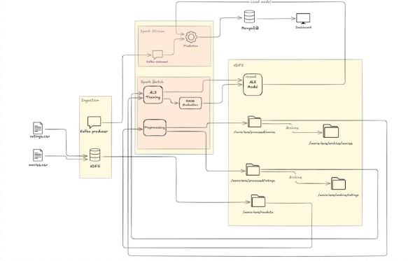
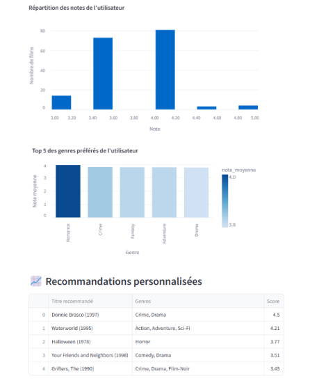
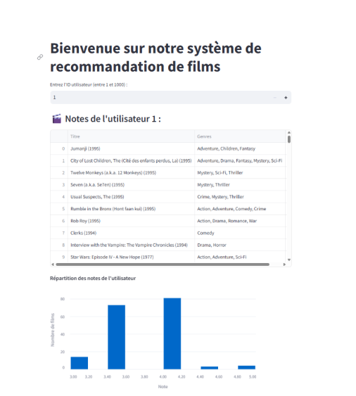

# Big Data Pseudo-distributed Environment with Hadoop, Spark, Kafka, Python, and Jupyter

## 🌍 Project Overview
This project provides a ready-to-use Dockerized environment to work with:
- **Hadoop 3.3.6** (pseudo-distributed)
- **Spark 3.5.1** (standalone mode)
- **Kafka 3.6.1** (with Zookeeper)
- **Python 3** + **PySpark**
- **Jupyter Notebook**

## 📊 Architecture
Link: https://excalidraw.com/#json=dtKT3FanGHM-1_wcIcS1s,Ea4JTPaOXIxLnHOOJOv6rw
- Hadoop HDFS for distributed file storage (single-node setup)
- Spark for batch and streaming data processing
- Kafka for streaming ingestion
- Python environment with Jupyter for development and experimentation

## 🔧 Project Structure
```
/
|-- Dockerfile
|-- docker-compose.yml
|-- Makefile
|-- requirements.txt
|-- entrypoint.sh
|-- config/
|   |-- hadoop/
|       |-- core-site.xml
|       |-- hdfs-site.xml
|       |-- mapred-site.xml
|       |-- yarn-site.xml
|       |-- hadoop-env.sh
|-- notebooks/
|   |-- data_exploration_processing.ipynb
|   |-- spark_kafka_consumer.py
|   |-- kafka_producer.py
|   |-- ALS.py
|-- scripts/
    |-- consumer.py
    |-- producer.py
    |-- hdfs_initialization.sh
```

## 🔄 Quick Start

### 1. Build the Docker Image
```bash
make build
```

### 2. Launch the Environment
```bash
make up
```

This will start:
- Hadoop HDFS & YARN
- Kafka + Zookeeper
- Jupyter Notebook (accessible on http://localhost:8888)

### 3. Access the Container
```bash
make shell
```

### 4. Shut Down
```bash
make down
```

### 5. Clean Everything (containers, images, volumes)
```bash
make clean
```
## 🚀 Run Streamlit App
```bash
streamlit run streamlit_app.py 
```
(http://localhost:8501)

## 📄 Notebooks & Scripts
- **data_exploration_processing.ipynb**: Interactive Jupyter notebook for exploring data and processing pipelines using Spark and Kafka.
- **spark_kafka_consumer.py**: Spark Structured Streaming consumer that reads from a Kafka topic and processes the streaming data.
- **kafka_producer.py**: Script that produces messages to a Kafka topic from a local CSV file.
- **ALS.py**: Python script implementing a collaborative filtering recommendation system using the Alternating Least Squares (ALS) algorithm in Apache Spark. The script performs data cleaning, enrichment, model training, evaluation, and generates movie recommendations based on user ratings.

## 🔔 Notes
- Hadoop HDFS Web UI: [http://localhost:9870](http://localhost:9870)
- Ensure you manually create Kafka topics using:
  ```bash
  kafka-topics.sh --create --topic test-topic --bootstrap-server localhost:9092
  ```
- Upload datasets to HDFS:
  ```bash
  hdfs dfs -mkdir -p /datasets
  hdfs dfs -put your_file.csv /datasets/
  ```
## 📋 Project Management
Track tasks and project progress on Trello: https://trello.com/b/ko0kNgex/basic-board

## 📊 Architecture


## 📸 App preview

